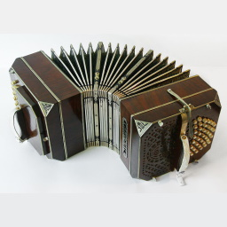

---
---
# Music Markdown-it plugin?

c1:                    Am
l1: All the leaves are brown

c1:                    Am     G  F          G      Esus4  E
l1: All the leaves are brown        and the sky is gray

c1: F               C     E  Am       F        Esus4  E
l1: I've been for a walk         on a winter's day

c1: Dm                    Am                G
l2: They don't know how   long it  takes
l1:            They don't know how long  it takes

---
youTubeId: acvIVA9-FMQ

---

---
chords:
  Gdim:
    - o3 b1,4,3 n2,4 n3,5 m5 m6

---

:::abc
C D E F G A B c
:::

:::vextab
options space=20

tabstave
  notation=true
  key=A time=4/4

  notes :q =|: (5/2.5/3.7/4) :8 7-5h6/3 ^3^ 5h6-7/5 ^3^ :q 7V/4 |
  notes :8 t12p7/4 s5s3/4 :8 3s:16:5-7/5 :h p5/4
  text :w, |#segno, ,|, :hd, , #tr
:::

{width=250}

{width=250}

